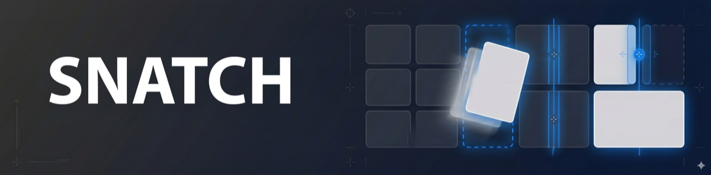
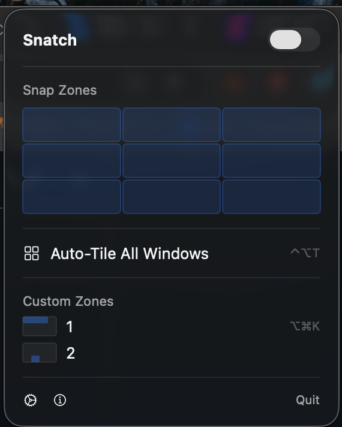
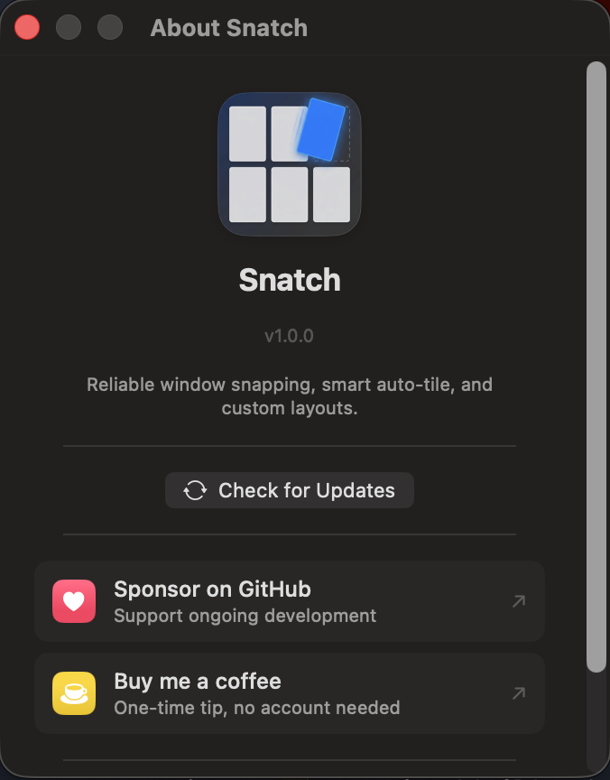

  

  <strong>Snap windows into place</strong> 
  Reliable window snapping, smart auto-tile, and custom layouts. One hotkey to organize your desktop.

  
  
  
  

  
  
  
  
  

  
  

  Built with Swift and SwiftUI. No Electron, no web views, no bloat.

---

## Screenshots

  
  &nbsp;&nbsp;
  

---

## Download

Download the latest version from [**Releases**](https://github.com/beyondthecode-bc/Snatch/releases/latest). Unzip, move `Snatch.app` to Applications, and launch.

The app includes a built-in update checker -- open **About** and click **Check Now** to see if a newer version is available.

## Features

- **Multi-Monitor Support** -- Full support for multiple displays. Snap zones, hotkeys, and the menu bar grid all detect which screen your window is on and position it correctly. Works with any resolution -- FHD, QHD, 4K, 5K, 6K, and 8K displays.
- **Edge Snap Zones** -- Drag any window to a screen edge or corner. A translucent overlay preview shows where the window will land. Release to snap. Edge sensitivity scales automatically for Retina and non-Retina displays.
- **Keyboard Shortcuts** -- 14 default hotkeys (Ctrl+Option+Arrow keys, U/I/J/K for quarters, D/F/G for thirds, Return for maximize, C for center, T for auto-tile). Fully customizable in Settings.
- **Smart Auto-Tile** -- One hotkey (Ctrl+Opt+T) to instantly arrange all visible windows into the best layout for the current count: side-by-side for 2, master+stack for 3, grid for 4+. Each monitor tiles its own windows independently.
- **Custom Snap Zones** -- Define your own layouts beyond halves and thirds. Use the visual 12x12 grid editor to create precise zones like 70/30 splits or narrow side panels.
- **Menu Bar Grid Picker** -- Click any zone in the popover grid to snap the focused window without memorizing shortcuts.
- **Launch at Login** -- Optional background launch via Settings.
- **8 Languages** -- English, French, German, Spanish, Japanese, Korean, Portuguese (BR), Chinese (Simplified).

## Requirements

| | Requirement |
|---|---|
| **OS** | macOS 14.0 (Sonoma) or later |
| **Chip** | Any Mac (Apple Silicon or Intel) |

## Getting Started

### 1. Download and install

Download the latest `.zip` from [Releases](https://github.com/beyondthecode-bc/Snatch/releases/latest), extract it, and move `Snatch.app` to your Applications folder.

### 2. Grant Accessibility permission

On first launch, Snatch will ask for Accessibility access. This is required to detect window drags and move windows.

1. Click **Grant Access** in the popover
2. In System Settings > Privacy & Security > Accessibility, toggle **Snatch** on

### 3. Start snapping

- **Drag** any window to a screen edge to see the snap preview
- Press **Ctrl+Option+Arrow** keys to snap via keyboard
- Press **Ctrl+Option+T** to auto-tile all visible windows
- Click the **menu bar icon** for the visual zone grid

## Translations

This repository hosts the translation files for Snatch. You can help translate the app into your language or improve existing translations.

### How to contribute

1. Fork this repository
2. Edit an existing file in the [`languages/`](languages/) folder, or create a new one by copying `English.xml`
3. Translate the string values (the text between `<string>` tags) -- **do not** change the `key` attributes
4. Keep any `%1`, `%2`, `%@`, `%d` placeholders in place -- the app needs them
5. Submit a pull request

### Current languages

| Language | File | Status |
|---|---|---|
| English | [`English.xml`](languages/English.xml) | Complete |
| French | [`French.xml`](languages/French.xml) | Complete |
| German | [`German.xml`](languages/German.xml) | Complete |
| Spanish | [`Spanish.xml`](languages/Spanish.xml) | Complete |
| Japanese | [`Japanese.xml`](languages/Japanese.xml) | Complete |
| Korean | [`Korean.xml`](languages/Korean.xml) | Complete |
| Portuguese (BR) | [`Portuguese.xml`](languages/Portuguese.xml) | Complete |
| Chinese (Simplified) | [`Chinese.xml`](languages/Chinese.xml) | Complete |

Want to add a new language? Copy `English.xml`, rename it to your language name, translate the values, and submit a PR.

## Bug Reports & Feature Requests

Please use [Issues](../../issues) to report bugs or request features.

## Support the Project

If Snatch is useful to you, consider supporting development:

  
  &nbsp;&nbsp;&nbsp;
  

---

## Troubleshooting

### "Snatch" Not Opened -- Gatekeeper warning

Snatch is not yet notarized with Apple. On first launch you may see a Gatekeeper warning.

**To fix this:**

1. Click **Done** to dismiss the dialog
2. Open **System Settings > Privacy & Security**
3. Scroll down -- you'll see a message that Snatch was blocked
4. Click **Open Anyway**

This only needs to be done once. After that, the app will open normally.

### Administrator password required when installing an update

When you click **Install Now** in the About window, macOS will show a password prompt before replacing the app in `/Applications`. This is expected -- the app needs elevated permissions to overwrite itself.
